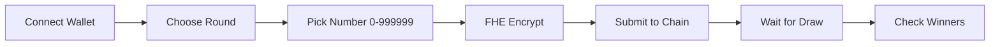

# ArenaPVP - Privacy-Preserving Lottery Platform

<div align="center">


[](https://docs.zama.ai/fhevm)
[](https://soliditylang.org/)
[](LICENSE)

**The world's first privacy-preserving lottery platform powered by Fully Homomorphic Encryption (FHE)**

[Live Demo](https://arenapvp.vercel.app) • [Documentation](#documentation) • [Video Tutorial](#video-demo)

</div>

---

## 🎯 Overview

ArenaPVP is a revolutionary blockchain-based lottery platform that ensures **complete privacy** for all participants. Unlike traditional lotteries where your numbers might be visible to operators or other players, ArenaPVP uses cutting-edge **Fully Homomorphic Encryption (FHE)** technology to keep your lucky numbers completely private throughout the entire process - from submission to winner verification.

### Key Highlights

✨ **Complete Privacy** - Your lottery numbers remain encrypted end-to-end
🔒 **FHE Encryption** - Numbers stay private even during on-chain verification
🎲 **Fair & Transparent** - Verifiable draws with immutable blockchain records
🏆 **Multi-Round Support** - Participate in multiple concurrent lottery rounds
💎 **Modern UI** - Beautiful glassmorphism design with real-time updates
⚡ **Gas Efficient** - Optimized smart contracts for lower transaction costs

---

## 📚 Table of Contents

- [How It Works](#-how-it-works)
- [Technology Stack](#-technology-stack)
- [Architecture](#-architecture)
- [Quick Start](#-quick-start)
- [Contract Details](#-contract-details)
- [Frontend Integration](#-frontend-integration)
- [Video Demo](#-video-demo)
- [Development](#-development)
- [Deployment](#-deployment)
- [Security](#-security)
- [Troubleshooting](#-troubleshooting)
- [License](#-license)

---

## 🎮 How It Works

### User Journey



### Detailed Flow

#### 1️⃣ **Round Creation** (Admin)
- Admin creates a lottery round with a specific **name** and **draw deadline**
- Each round accepts encrypted ticket submissions until the deadline
- Multiple rounds can run concurrently

#### 2️⃣ **Ticket Purchase** (Users)
- Users select a lucky number between **0 and 999,999**
- The number is encrypted **client-side** using Zama's FHE SDK
- Encrypted number + cryptographic proof submitted to the smart contract
- Your number remains **completely private** - not even the admin can see it!

#### 3️⃣ **Draw Process** (Admin)
- After the round deadline passes, admin draws a **plaintext winning number**
- The winning number is converted to encrypted format on-chain
- Round is marked as "drawn" and no more tickets can be purchased

#### 4️⃣ **Winner Verification** (Off-chain/Gateway)
- Winners are verified by comparing encrypted ticket numbers with the winning number
- This can be done off-chain via FHE gateway or through decryption
- Winner addresses are published on-chain for transparency

#### 5️⃣ **Results Announcement** (Public)
- Winning number is publicly visible after draw
- Winner addresses are published (but their chosen numbers remain private)
- Users can verify if they won without revealing their numbers to others

---

## 🛠️ Technology Stack

### Smart Contract Layer

| Component | Version | Purpose |
|-----------|---------|---------|
| **Solidity** | 0.8.24 | Smart contract language |
| **Zama fhEVM** | 0.8.0 | FHE-enabled Ethereum Virtual Machine |
| **Hardhat** | Latest | Development environment & testing |
| **OpenZeppelin** | Latest | Secure contract utilities |

**Key Contract Types:**
- `euint32` - Encrypted 32-bit unsigned integer for lottery numbers
- `externalEuint32` - External encrypted type for user inputs
- `ebool` - Encrypted boolean for comparisons

### Frontend Layer

| Component | Version | Purpose |
|-----------|---------|---------|
| **React** | 18.x | UI framework |
| **TypeScript** | 5.x | Type safety |
| **Vite** | 5.x | Build tool & dev server |
| **Wagmi** | 2.x | Web3 React hooks |
| **RainbowKit** | 0.12.x | Wallet connection UI |
| **Zama Relayer SDK** | 0.2.0 | FHE encryption client |
| **shadcn/ui** | Latest | UI component library |
| **Tailwind CSS** | 3.x | Styling framework |

### Infrastructure

- **Network**: Ethereum Sepolia Testnet
- **RPC**: Public Sepolia RPC endpoints
- **Deployment**: Vercel (Frontend) + Hardhat Deploy (Contracts)
- **IPFS**: Optional for ticket metadata

---

## 🏗️ Architecture

### System Architecture

```
┌─────────────────────────────────────────────────────────────┐
│                         Frontend (React)                     │
│  ┌──────────────┐  ┌──────────────┐  ┌──────────────┐      │
│  │   Wagmi v2   │  │  RainbowKit  │  │  Zama SDK    │      │
│  │  (Web3 Hooks)│  │  (Wallets)   │  │  (FHE Crypt) │      │
│  └──────────────┘  └──────────────┘  └──────────────┘      │
└─────────────────────────────────────────────────────────────┘
                            ▼
┌─────────────────────────────────────────────────────────────┐
│                    Zama Relayer Service                      │
│               (FHE Encryption/Decryption)                    │
└─────────────────────────────────────────────────────────────┘
                            ▼
┌─────────────────────────────────────────────────────────────┐
│              Ethereum Sepolia Testnet (fhEVM)                │
│  ┌──────────────────────────────────────────────────────┐   │
│  │           FHELottery Smart Contract                  │   │
│  │  ┌────────────┐  ┌────────────┐  ┌────────────┐    │   │
│  │  │  Rounds[]  │  │  Tickets[] │  │  Winners[] │    │   │
│  │  │  (Public)  │  │ (Encrypted)│  │  (Public)  │    │   │
│  │  └────────────┘  └────────────┘  └────────────┘    │   │
│  └──────────────────────────────────────────────────────┘   │
└─────────────────────────────────────────────────────────────┘
```

### Smart Contract Architecture

```solidity
FHELottery Contract
│
├── State Variables
│   ├── rounds: LotteryRound[]      // Array of all lottery rounds
│   └── admin: address              // Admin address for management
│
├── Structs
│   ├── LotteryRound
│   │   ├── name: string            // Round name
│   │   ├── drawTime: uint256       // Deadline timestamp
│   │   ├── drawn: bool             // Draw completion status
│   │   ├── winningNumber: euint32  // Encrypted winning number
│   │   ├── tickets: Ticket[]       // Array of tickets
│   │   └── winners: address[]      // Winner addresses
│   │
│   └── Ticket
│       ├── buyer: address          // Ticket purchaser
│       └── number: euint32         // Encrypted lottery number
│
├── Admin Functions
│   ├── createRound()               // Create new lottery round
│   ├── draw()                      // Set winning number & mark drawn
│   └── addWinners()                // Add verified winner addresses
│
├── User Functions
│   └── buyTicket()                 // Purchase ticket with FHE encrypted number
│
└── View Functions
    ├── getRound()                  // Get round information
    ├── getWinners()                // Get winner addresses
    ├── getUserTickets()            // Get user's ticket indices
    ├── isWinner()                  // Check if user won
    └── roundsCount()               // Total number of rounds
```

### Data Flow Diagram

```
User Action                  Frontend                Contract              Blockchain
────────────────────────────────────────────────────────────────────────────────

Pick Number (123456)
      │
      ├──────────▶ FHE Encrypt
                  with Zama SDK
                        │
                        ├──────────▶ Generate Proof
                                          │
                                          ├──────────▶ buyTicket()
                                                      (encrypted, proof)
                                                            │
                                                            ├──────▶ Validate
                                                                    FHE.fromExternal()
                                                                         │
                                                                         ├──────▶ Store
                                                                                 euint32
                                                                                   │
                                                                                   ▼
                                                                             [Encrypted]
                                                                             on-chain

──────────────────────── AFTER DEADLINE ────────────────────────────────────────

Admin draws (456789)
      │
      ├──────────▶ Submit plaintext
                        │
                        ├──────────▶ draw()
                                    Convert to euint32
                                          │
                                          ├──────────▶ Mark round.drawn=true
                                                            │
                                                            ▼
                                                      Off-chain verification
                                                      (compare encrypted)
                                                            │
                                                            ├──────▶ addWinners()
                                                                         │
                                                                         ▼
                                                                    Publish
                                                                    addresses
```

---

## 🚀 Quick Start

### Prerequisites

- **Node.js** >= 18.0.0
- **Yarn** or npm
- **MetaMask** or compatible Web3 wallet
- **Sepolia Testnet ETH** ([Get from faucet](https://sepoliafaucet.com))

### Installation

1. **Clone the repository**:
```bash
git clone https://github.com/yourusername/ArenaPVP.git
cd ArenaPVP
```

2. **Install dependencies**:
```bash
# Install root dependencies
yarn install

# Install contract dependencies
cd contracts
yarn install
cd ..
```

### Deploy Smart Contract

1. **Configure environment**:
```bash
cd contracts
cp .env.example .env
```

Edit `.env`:
```env
PRIVATE_KEY=your_private_key_here
SEPOLIA_RPC_URL=https://ethereum-sepolia-rpc.publicnode.com
```

2. **Compile contracts**:
```bash
npx hardhat compile
```

3. **Deploy to Sepolia**:
```bash
SEPOLIA_RPC_URL="https://ethereum-sepolia-rpc.publicnode.com" npx hardhat run scripts/deploy.js --network sepolia
```

4. **Save the contract address** from output:
```
FHELottery deployed to: 0xYourContractAddress...
```

5. **Create initial lottery rounds** (optional):
```bash
SEPOLIA_RPC_URL="https://ethereum-sepolia-rpc.publicnode.com" npx hardhat run scripts/create-multiple-rounds.js --network sepolia
```

### Configure Frontend

1. **Create frontend environment file**:
```bash
cp .env.example .env
```

2. **Edit `.env`** with your contract address:
```env
VITE_CONTRACT_ADDRESS=0xYourContractAddress
VITE_CHAIN_ID=11155111
```

3. **Start development server**:
```bash
yarn dev
```

4. **Open in browser**:
```
http://localhost:8080
```

---

## 📜 Contract Details

### Core Functions

#### Admin Functions

##### `createRound(string name, uint256 drawTime)`
Creates a new lottery round.

**Parameters:**
- `name` - Round name (e.g., "Weekly Lottery #1")
- `drawTime` - Unix timestamp for draw deadline

**Requirements:**
- Only admin can call
- `drawTime` must be in the future

**Example:**
```javascript
const drawTime = Math.floor(Date.now() / 1000) + (7 * 24 * 60 * 60); // 7 days
await contract.createRound("Weekly Lottery #1", drawTime);
```

##### `draw(uint256 roundId, uint32 plainWinningNumber)`
Draws the winning number for a round.

**Parameters:**
- `roundId` - Round index
- `plainWinningNumber` - Winning number (0-999999)

**Requirements:**
- Only admin can call
- Current time >= drawTime
- Round not already drawn

**Example:**
```javascript
await contract.draw(0, 123456);
```

##### `addWinners(uint256 roundId, address[] winners)`
Adds verified winner addresses.

**Parameters:**
- `roundId` - Round index
- `winners` - Array of winner addresses

**Requirements:**
- Only admin can call
- Round must be drawn

**Example:**
```javascript
await contract.addWinners(0, ["0xWinner1...", "0xWinner2..."]);
```

#### User Functions

##### `buyTicket(uint256 roundId, externalEuint32 number, bytes proof)`
Purchases a lottery ticket with an encrypted number.

**Parameters:**
- `roundId` - Round to participate in
- `number` - FHE encrypted lottery number
- `proof` - Cryptographic proof from Zama SDK

**Requirements:**
- Round exists and not drawn
- Current time < drawTime

**Example (Frontend):**
```typescript
import { encryptUint32 } from '@/lib/fhe';

// Encrypt number
const { handle, proof } = await encryptUint32(
  lotteryNumber,
  contractAddress,
  userAddress
);

// Submit transaction
await contract.buyTicket(roundId, handle, proof);
```

#### View Functions

##### `getRound(uint256 roundId)` → Round Info
Returns round information.

**Returns:**
- `name` - Round name
- `winningNumber` - Winning number (0 if not drawn)
- `drawTime` - Deadline timestamp
- `drawn` - Whether round is drawn
- `ticketCount` - Total tickets sold
- `winnerCount` - Number of winners

##### `getUserTickets(uint256 roundId, address user)` → uint256[]
Returns array of ticket indices owned by user.

##### `isWinner(uint256 roundId, address user)` → bool
Checks if user is a winner (only after draw).

##### `getWinners(uint256 roundId)` → address[]
Returns array of winner addresses (only after draw).

##### `roundsCount()` → uint256
Returns total number of rounds created.

### Contract Events

```solidity
// Note: Add these events for better tracking
event RoundCreated(uint256 indexed roundId, string name, uint256 drawTime);
event TicketPurchased(uint256 indexed roundId, address indexed buyer, uint256 ticketIndex);
event RoundDrawn(uint256 indexed roundId, uint32 winningNumber);
event WinnersAdded(uint256 indexed roundId, address[] winners);
```

---

## 🎨 Frontend Integration

### FHE Encryption

The frontend uses Zama's Relayer SDK to perform client-side FHE encryption:

```typescript
// src/lib/fhe.ts
import { RelayerClient, EncryptedValue } from '@/types/fhe';

// Initialize FHE SDK
export async function initFHE(
  provider: any,
  contractAddress: string
): Promise<RelayerClient> {
  const relayer = await window.relayerSDK.createRelayerClient(
    provider,
    contractAddress
  );
  return relayer;
}

// Encrypt a uint32 value
export async function encryptUint32(
  value: number,
  contractAddress: string,
  userAddress: string
): Promise<EncryptedValue> {
  const provider = window.ethereum;
  const relayer = await initFHE(provider, contractAddress);

  const encrypted = await relayer.encrypt32(value);

  return {
    handle: encrypted.handles[0],
    proof: encrypted.inputProof
  };
}
```

### React Hooks

Custom hooks for contract interactions:

```typescript
// src/hooks/useLottery.ts
import { useReadContract, useWriteContract } from 'wagmi';

// Get total rounds
export function useRoundsCount() {
  return useReadContract({
    address: CONTRACTS.FHELottery,
    abi: ABIS.FHELottery,
    functionName: 'roundsCount',
  });
}

// Get round info
export function useRound(roundId: bigint) {
  return useReadContract({
    address: CONTRACTS.FHELottery,
    abi: ABIS.FHELottery,
    functionName: 'getRound',
    args: [roundId],
  });
}

// Buy ticket
export function useBuyTicket() {
  return useWriteContract();
}
```

### Component Example

```typescript
// BuyTicket component
const BuyTicketDialog = ({ roundId }) => {
  const [number, setNumber] = useState('');
  const { address } = useAccount();
  const { writeContractAsync } = useBuyTicket();

  const handleSubmit = async () => {
    // 1. Encrypt the number
    const { handle, proof } = await encryptUint32(
      parseInt(number),
      CONTRACTS.FHELottery,
      address
    );

    // 2. Submit transaction
    await writeContractAsync({
      address: CONTRACTS.FHELottery,
      abi: ABIS.FHELottery,
      functionName: 'buyTicket',
      args: [roundId, handle, proof],
    });
  };

  return (
    <Dialog>
      <Input
        type="number"
        min={0}
        max={999999}
        value={number}
        onChange={(e) => setNumber(e.target.value)}
      />
      <Button onClick={handleSubmit}>Buy Ticket</Button>
    </Dialog>
  );
};
```

---

## 🎬 Video Demo

Watch the complete walkthrough of ArenaPVP:

- **Platform Overview** - Interface and features
- **Buying Tickets** - FHE encryption process
- **Drawing Winners** - Admin operations
- **Checking Results** - Winner verification

📹 [Watch Demo Video](https://arenapvp.vercel.app/about)

---

## 💻 Development

### Project Structure

```
ArenaPVP/
├── contracts/                    # Smart contracts
│   ├── src/
│   │   └── ArenaPVP.sol         # Main FHELottery contract
│   ├── scripts/
│   │   ├── deploy.js            # Deployment script
│   │   ├── create-round.js      # Create single round
│   │   └── create-multiple-rounds.js # Batch create rounds
│   ├── hardhat.config.js        # Hardhat configuration
│   └── package.json
│
├── src/                         # Frontend React app
│   ├── components/
│   │   ├── Hero.tsx             # Landing hero section
│   │   ├── ActiveRounds.tsx     # Display lottery rounds
│   │   ├── BuyTicketDialog.tsx  # Ticket purchase UI
│   │   ├── MyTickets.tsx        # User's tickets view
│   │   ├── Winners.tsx          # Winner announcements
│   │   ├── Navigation.tsx       # App navigation
│   │   └── ui/                  # shadcn/ui components
│   │
│   ├── pages/
│   │   ├── Home.tsx             # Main page
│   │   └── About.tsx            # About & docs page
│   │
│   ├── hooks/
│   │   └── useLottery.ts        # Contract interaction hooks
│   │
│   ├── lib/
│   │   ├── fhe.ts               # FHE encryption utilities
│   │   └── utils.ts             # Helper functions
│   │
│   ├── contracts/
│   │   ├── constants.ts         # Contract addresses
│   │   └── FHELotteryABI.json   # Contract ABI
│   │
│   └── App.tsx                  # Root component
│
├── public/
│   ├── demovedio.mp4            # Demo video
│   └── ...
│
├── .env.example                 # Environment template
├── vite.config.ts               # Vite configuration
├── tailwind.config.js           # Tailwind CSS config
└── package.json
```

### Local Development

#### Start Local Hardhat Node

```bash
cd contracts
npx hardhat node
```

#### Deploy to Local Network

```bash
npx hardhat run scripts/deploy.js --network localhost
```

#### Run Frontend Against Local Node

Update `.env`:
```env
VITE_CONTRACT_ADDRESS=0xYourLocalContractAddress
VITE_CHAIN_ID=31337
VITE_RPC_URL=http://127.0.0.1:8545
```

```bash
yarn dev
```

### Testing

#### Contract Tests

```bash
cd contracts
npx hardhat test
```

#### Frontend Tests

```bash
yarn test
```

### Code Quality

```bash
# Lint
yarn lint

# Format
yarn format

# Type check
yarn typecheck
```

---

## 🌐 Deployment

### Deploy to Vercel

1. **Install Vercel CLI**:
```bash
npm i -g vercel
```

2. **Login to Vercel**:
```bash
vercel login
```

3. **Deploy**:
```bash
vercel --prod
```

4. **Set Environment Variables** in Vercel dashboard:
```
VITE_CONTRACT_ADDRESS=0x...
VITE_CHAIN_ID=11155111
```

### CORS Configuration

For FHE WASM support, ensure proper CORS headers in `vite.config.ts`:

```typescript
export default defineConfig({
  server: {
    headers: {
      "Cross-Origin-Opener-Policy": "same-origin",
      "Cross-Origin-Embedder-Policy": "require-corp",
    },
  },
});
```

For production (Vercel), add `vercel.json`:

```json
{
  "rewrites": [
    {
      "source": "/(.*)",
      "destination": "/index.html"
    }
  ],
  "headers": [
    {
      "source": "/(.*)",
      "headers": [
        {
          "key": "Cross-Origin-Opener-Policy",
          "value": "same-origin"
        },
        {
          "key": "Cross-Origin-Embedder-Policy",
          "value": "require-corp"
        }
      ]
    }
  ]
}
```

---

## 🔒 Security

### Best Practices

1. **Private Keys**
   - Never commit `.env` files
   - Use hardware wallets for mainnet
   - Rotate keys regularly

2. **Admin Access**
   - Admin functions are restricted via `onlyAdmin` modifier
   - Consider multi-sig for production
   - Monitor admin transactions

3. **Input Validation**
   - Number range validated on-chain (0-999999)
   - FHE proofs verified by contract
   - Timestamp checks prevent early draws

4. **FHE Security**
   - Numbers encrypted client-side
   - Proofs prevent tampering
   - No plaintext exposure on-chain

### Audit Status

⚠️ **This contract has NOT been audited. Use at your own risk.**

For production deployment, we recommend:
- Third-party security audit
- Bug bounty program
- Gradual rollout with limits

---

## 🐛 Troubleshooting

### Issue: FHE Encryption Fails

**Symptoms:**
- "Failed to encrypt number" error
- Transaction reverts with proof error

**Causes & Solutions:**

1. **Relayer Service Down**
   - Check Zama relayer status
   - Try again in a few minutes
   - Use alternative RPC endpoint

2. **CORS Headers Missing**
   - Verify CORS headers in browser DevTools
   - Check `vite.config.ts` configuration
   - Ensure SharedArrayBuffer is available

3. **Browser Compatibility**
   - Use Chrome, Firefox, or Edge
   - Enable SharedArrayBuffer
   - Disable restrictive extensions

### Issue: Transaction Reverts

**Error Messages & Solutions:**

| Error | Cause | Solution |
|-------|-------|----------|
| "Round not exist" | Invalid roundId | Check `roundsCount()` first |
| "Already drawn" | Round completed | Choose an active round |
| "Round closed" | Past deadline | Check `drawTime` |
| "Only admin" | Unauthorized | Use admin account |
| "Cannot draw before draw time" | Too early | Wait until deadline |

### Issue: Winners Not Showing

**Symptoms:**
- Round is drawn but winners array is empty

**Cause:**
- Winners not added via `addWinners()` yet

**Solution:**
1. Admin must verify winners off-chain
2. Call `addWinners()` with winner addresses
3. Frontend will then display results

### Issue: Wallet Connection Fails

**Solutions:**
- Ensure MetaMask is installed
- Switch to Sepolia network
- Clear browser cache
- Try different wallet (OKX, Coinbase)

### Issue: "No Active Rounds"

**Solutions:**
- Check if any rounds exist: call `roundsCount()`
- Create rounds via admin script
- Verify contract address in `.env`
- Check network (must be Sepolia)

---

## 📄 License

This project is licensed under the MIT License - see the [LICENSE](LICENSE) file for details.

---

## 🌟 Acknowledgments

- **Zama** - For pioneering FHE technology and fhEVM
- **Ethereum Foundation** - For the Sepolia testnet
- **shadcn/ui** - For beautiful UI components
- **Wagmi & RainbowKit** - For excellent Web3 tooling

---

## 📞 Support & Community

- **Issues**: [GitHub Issues](https://github.com/yourusername/ArenaPVP/issues)
- **Documentation**: [Zama Docs](https://docs.zama.ai/fhevm)
- **Discord**: [Zama Discord](https://discord.gg/zama)

---

## 🗺️ Roadmap

### Phase 1: MVP ✅
- [x] Core FHE lottery contract
- [x] Client-side encryption
- [x] Multi-round support
- [x] Winner verification

### Phase 2: Enhancement 🚧
- [ ] Automatic winner detection via FHE gateway
- [ ] Prize pool management (ETH/tokens)
- [ ] NFT tickets with metadata
- [ ] Historical statistics dashboard

### Phase 3: Scaling 📋
- [ ] Multi-chain deployment (Polygon, Arbitrum)
- [ ] Layer 2 integration
- [ ] Mobile app (React Native)
- [ ] Governance token

### Phase 4: Advanced Features 💡
- [ ] Multi-number tickets
- [ ] Jackpot rollovers
- [ ] Social features (groups, chat)
- [ ] Analytics & insights

---

<div align="center">

**Built with ❤️ using Zama FHE Technology**

[Website](https://arenapvp.vercel.app) • [GitHub](https://github.com/yourusername/ArenaPVP) • [Twitter](https://twitter.com/yourhandle)

</div>
